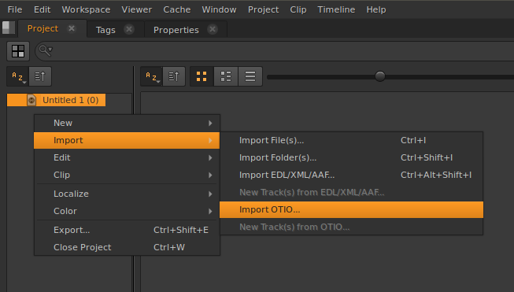
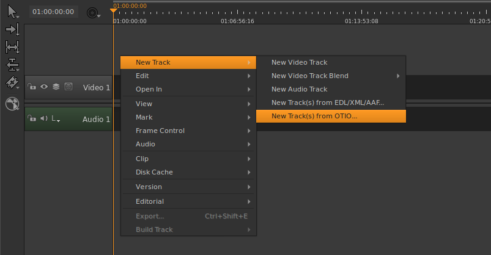
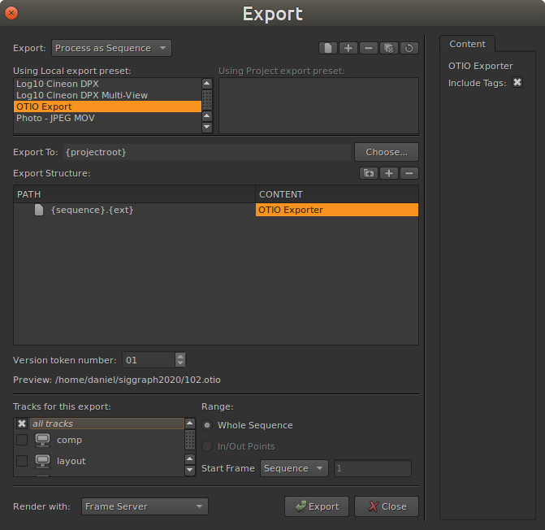

# OpenTimelineIO Import/Export Plugin for Hiero and Nuke Studio


Import and export `.otio` files directly from Hiero or Nuke Studio


##Features

* Multiple tracks
* Tags
* Markers
* Simple re-time (reverese, constant slowdown, constant speedup)
* Fade in/out and cross dissolves
* Nested sequences are created separately and replaced with gaps in the main sequence.
* Linked audio/video when clip shares same media source
   

##Install

The easiest way to install the plugin is to unpack the contents to the `.nuke` 
folder in your "HOME" directory.<br>
For Hiero/Nuke Studio version < 12 extract to the `.hiero` folder.

```bash
~/.nuke/Python/Startup/otioexporter
~/.nuke/Python/StartupUI/otioimporter
```

If you choose to install the plugin to another location, make sure to append 
the full path of the folder conatinong the `Python` folder to the 
`HIERO_PLUGIN_PATH` environment variable.

```bash
export HIERO_PLUGIN_PATH=/my/shared/plugin/folder
```

###Note

Make sure you have OpenTimelineIO available in `PYTHONPATH` before you launch.


##Usage OTIO Import

Right click in a project bin and select `"Import->Import OTIO"`



Or you can add tracks to an existing sequence




##Usage OTIOExportTask

In Hiero's export dialog choose `"Process as Sequence"` and create a new preset 
called `"OTIO Export"`.<br>
Add a new **PATH** and choose `"OTIO Exporter"` from the list of available 
exporters in the **CONTENT** column.<br> 
Make sure to either use the `{ext}` token or end your filename with an 
`.otio` extension.<br>
The `"include tags"` checkbox toggles inclusion of tags assigned to clips in 
the OTIO metadata.<br>




##Known Limitations

* Tags/markers are applied to both clips and track items on import if no 
  metadata indicates source type. 
